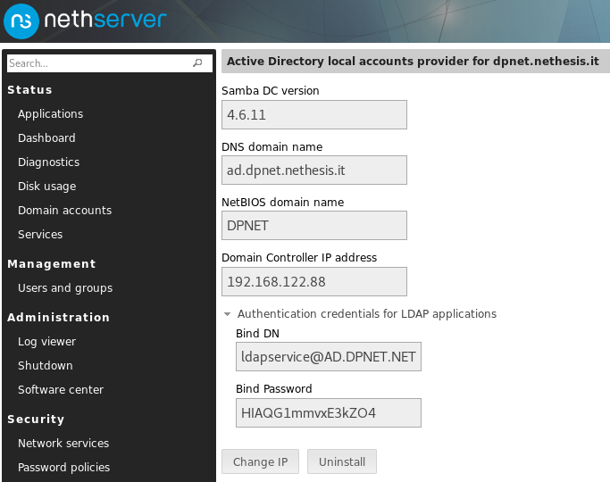
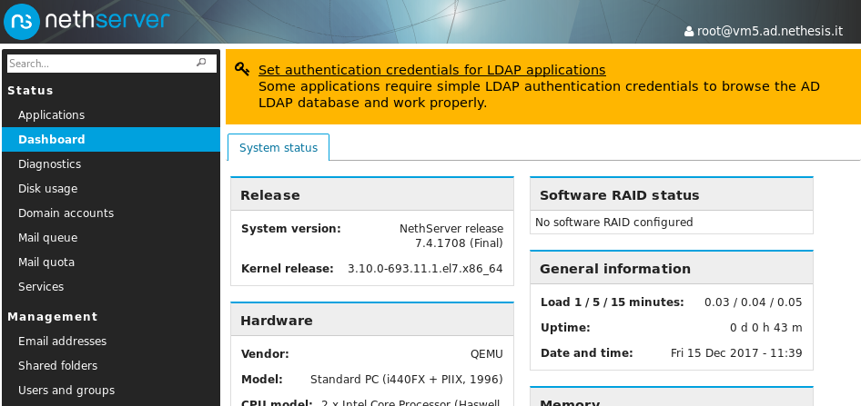
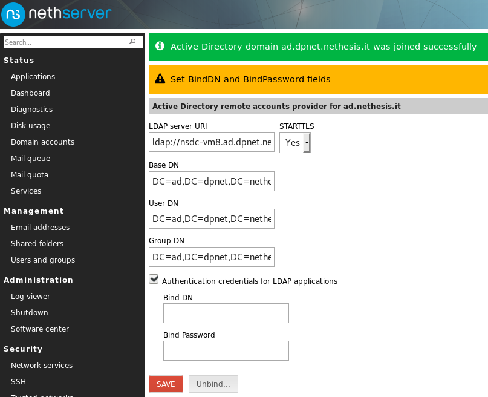
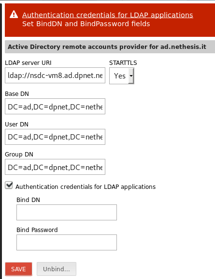
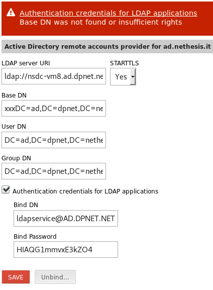

<i class="fa fa-database" aria-hidden="true"></i>

# AD access for LDAP simple auth applications

<i class="fa fa-github" aria-hidden="true"></i> [NethServer/dev#5396](https://github.com/NethServer/dev/issues/5396)

---

## The issue

* WebTop5, SOGo, Roundcube, Ejabberd can't rely on SSSD to gather account/contact information <!-- .element: class="fragment" -->

* They require direct LDAP access <!-- .element: class="fragment" -->

* They require to authenticate on LDAP <!-- .element: class="fragment" -->

---

## Account providers

* Local / Remote

* **Active Directory** / LDAP

---

## Current solutions

* Local AD &rarr; Samba machine credentials <!-- .element: class="fragment" -->

* Local LDAP &rarr; No credentials required (Anonymous bind) <!-- .element: class="fragment" -->

* Remote AD &rarr; Samba machine credentials (Do not work with MS &rarr; Insert credentials) <!-- .element: class="fragment" -->

* Remote LDAP &rarr; Insert credentials <!-- .element: class="fragment" -->

---

## Limitations

Insert credentials?

Forgot <!-- .element: class="fragment" -->

---

## Limitations of machine credentials in LDAP auth

* Samba 4.6: very long machine password with strange chars (broken apps)

* Machine passwords should be changed every month <!-- .element: class="fragment" -->

* Samba could follow MS behavior and not accept them anymore <!-- .element: class="fragment" -->

---

## Today's Solution: dedicated credentials

* `ldapservice`: same identity used by the OpenLDAP accounts provider

*  <!-- .element: class="fragment" --> Local AD &rarr; create `ldapservice` and set password automatically 

* Remote AD &rarr; display TODO, if credentials are required <!-- .element: class="fragment" -->

* Bonus: Remote LDAP credentials validation <!-- .element: class="fragment" -->

---

## Local AD

`ldapservice` account credentials (not a Unix account, cannot log on domain workstations)

 <!-- .element height="50%" width="50%" -->

---

## Remote AD &ndash; warning 1

After a new application has been installed, or if still relying on machine credentials

---

## Remote AD &ndash; warning 2

After joining the AD domain

  <!-- .element height="50%" width="50%" -->

---

## Remote AD &ndash; credentials error

Still no credentials?

  <!-- .element height="50%" width="50%" -->

---

## Remote AD &ndash; wrong parameters

  <!-- .element height="50%" width="50%" -->

---

## Bonus validation

Connection parameters are validated against **remote LDAP provider**, too!

---

## Developer's corner

* applications that include the `NethServer::SSSD` Perl module are notified 
  automatically when LDAP connection parameters change <i class="fragment"> &ndash; DEPRECATED</i> 

* <!-- .element: class="fragment" --> Applications should explicitly subscribe `nethserver-sssd-save` event with 
  an action or template expansion

---

## <i class="fa fa-phone" aria-hidden="true"></i> Call for QA 

---

## Links

- https://github.com/NethServer/dev/issues/5396
- https://community.nethserver.org/t/remote-ad-forcing-bind-user/8229
- https://community.nethserver.org/t/special-account-for-applications-with-simple-ldap-bind/8175
